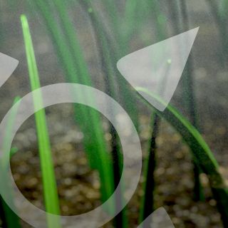
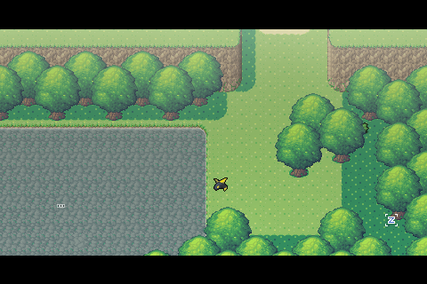
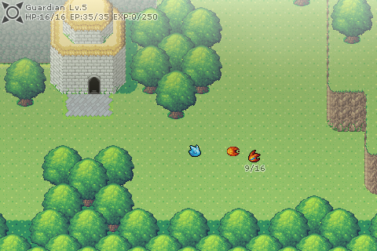
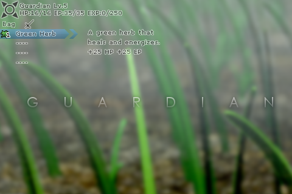
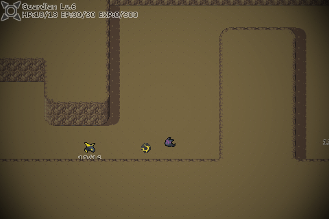

  

[![License][license-img]][license-url]
[![Windows][windows-img]][windows-url]
[![Donate][donate-img]][donate-url]

A real time monster based RPG I made for Game Maker's 2011 summer competition. Pretty old, I made this back when I was 16. Written in Game Maker 8.1, and never upgraded since it depended on 8.1's JIT compiler.

## Screenshots

|  |  |
|:-:|:-:|
|  |  |

## Controls

- **Arrow Keys** - Move

- **Z** - Interact

- **X/A/S** - Bindable Attacks, each beast can level up to learn new attacks, which you can bind in the main menu

- **Enter** - Pause Menu

[donate-img]: http://img.shields.io/:$-patreon-green.svg?style=flat-square
[donate-url]: https://www.patreon.com/alaingalvan
[license-img]: http://img.shields.io/:license-mit-blue.svg?style=flat-square
[license-url]: https://opensource.org/licenses/MIT  
[steam-url]: https://steamcommunity.com/sharedfiles/filedetails/?id=101432890&tscn=1350763601
[steam-img]: https://img.shields.io/badge/steam-workshop-2a2a2a.svg?style=flat-square
[windows-img]: http://img.shields.io/:download-win-03b3fe.svg?style=flat-square
[windows-url]: https://github.com/alaingalvan/guardian-gm81/raw/master/builds/windows/guardian.exe 